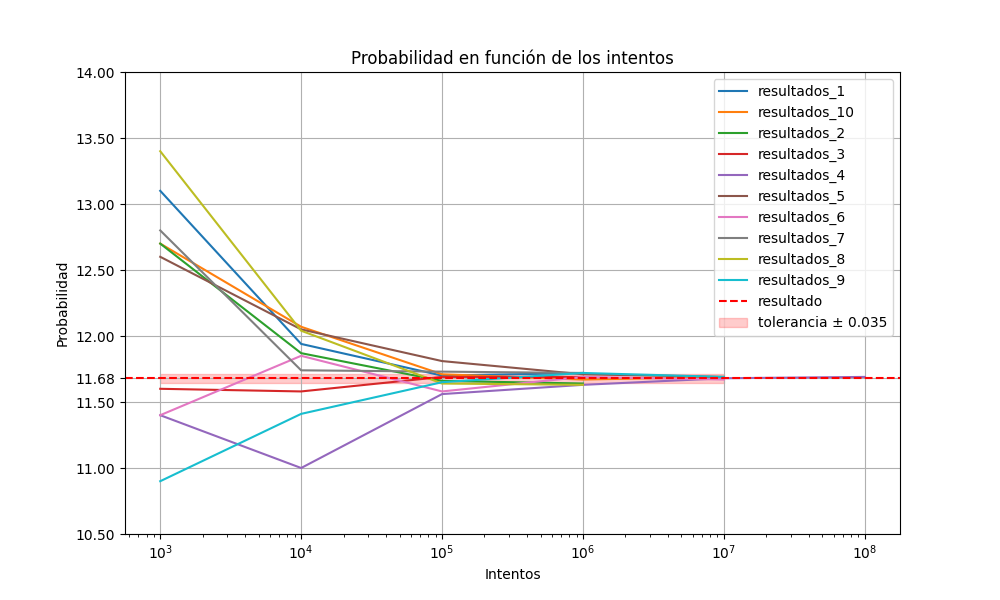

# GameCard
This is a game card code, and its test. The description and results are explained below.

# Changelog

 * Some libraries are now required, see "requirements.txt".
 * Added "informe.txt" with the details of the calculations.
 * A graph is generated with the results.
 * The graph now displays the result and its deviation.
 * A file with the combined data in columns is generated.
 * The code has been optimized.
 * Constants are loaded from the ".env" file.
 * New results on "informe.txt" and "prob.png".
 * The number of the new test was incremented by 5 (total 10 test).
 * Results on this file are updated.
 * All results in Spanish for didactic reasons. TODO -> English translation.
 * First version of this project can be found in: https://github.com/javierc90/Leander/
  
# Description
This program is the results of the Leandergames interview challenge. The statement is copied below:

_Python Test
Consider the following game:
From one deck of poker cards (52 cards) you place cards face up in a ring of 12 positions. The 13th card is placed
in the middle of the ring. If an Ace was put on the first position (“place one”) or a deuce on “place two” and so
on (a king on “place 13”) you have a match. You simply skip that place on the next lap and continue to place
cards on top of the cards not corresponding to their positions.
Every time you have a new match you pick up the cards on that certain position and place them in the bottom of
your deck and leave the matched card on its position in the ring. You continue this procedure until you either
run out of cards or have all 13 positions matched.
You win if you have all 13 positions matched.
What is the probability of winning the game?
Please provide the answer together with simulation code in Python._

# Answer

_Spoiler Alert_

The results of this research is the probability to win in this game is (11.68 ± 0.035)%. Its development will be explained below. 

# How to use

To run de code, just run "juego.py". In the "mazo.py" are specified the classes used in this program. Since the probability of winning this game is too complex to calculate mathematically, i resorted to test code that calculates the percentage of wins, experimentally. To run the test, just run "test.py", it will run 5 attemps to get the probability with 3σ to get 99.7% confidence of the result, where σ is the standard deviation. The program will create a file for each of the tests carried out.

# Requirements

Python 3.7 or above and the following extra modules, specified in requirements.txt for easy instalation:
 * matplotlib==3.4.3
 * numpy==1.20.2
 * pandas==1.2.4
 * python-dotenv==1.0.0

# Results

The result of this experiment yielded the following values:

|  intentos  |  resultados_1  |  resultados_2  |  resultados_3  |  resultados_4  |  resultados_5  |  resultados_6  |  resultados_7  |  resultados_8  |  resultados_9  |  resultados_10  |
|------------|----------------|----------------|----------------|----------------|----------------|----------------|----------------|----------------|-----------------|-----------------|
|    1000    |     13.10      |     12.70      |     11.60      |     11.40      |     12.60      |     11.40      |     12.80      |     13.40      |     10.90      |      12.70      |
|   10000    |     11.94      |     11.87      |     11.58      |     11.00      |     12.05      |     11.85      |     11.74      |     12.04      |     11.41      |      12.07      |
|  100000    |     11.70      |     11.66      |     11.69      |     11.56      |     11.81      |     11.58      |     11.73      |     11.64      |     11.65      |      11.71      |
| 1000000    |     11.72      |     11.64      |     11.69      |     11.63      |     11.71      |     11.69      |     11.72      |     11.63      |     11.72      |      11.67      |
|10000000    |     11.72      |     11.64      |     11.69      |     11.68      |     11.69      |     11.67      |     11.72      |     11.63      |     11.69      |      11.69      |
|100000000   |     11.72      |     11.64      |     11.69      |     11.69      |     11.69      |     11.67      |     11.72      |     11.63      |     11.69      |      11.69      |

The final result is (11.68 ± 0.035)% probability of winning this game, according to the tests carried out. This value is the same of the previous version.

# Final comments

In this case, unlike the previous version, some additional modules are used to create plots, reports, and optimize the code. As explained above, the probability was calculated experimentally, and the result obtained shows a clear trend towards the found probability.

# Version 

Version 2.0

# Author

* Javier Carugno
* Electronic engineering student at National Technological University, Argentina
* javiercarugno@gmail.com
